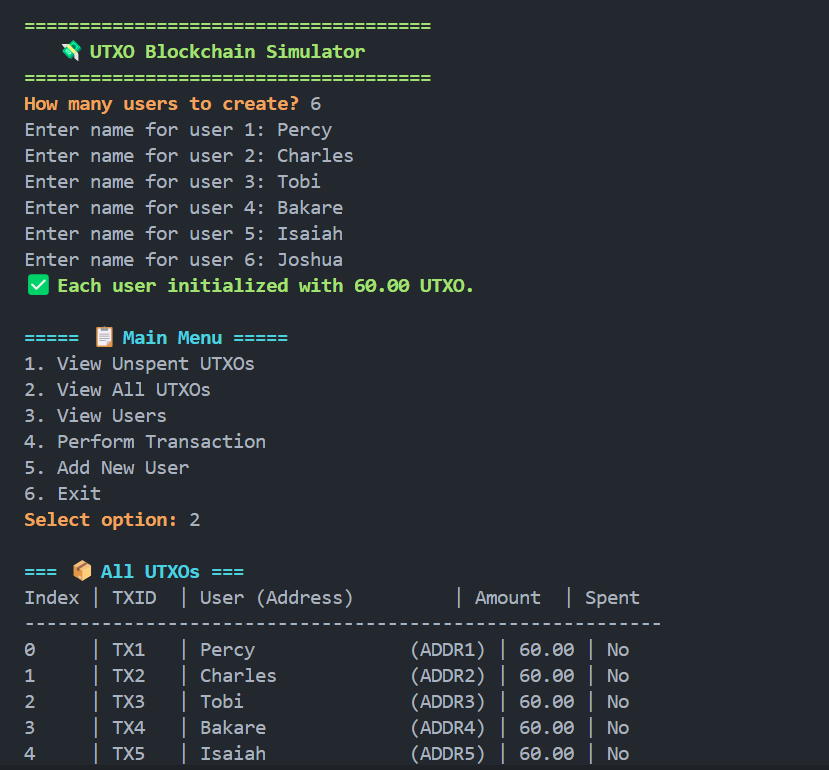
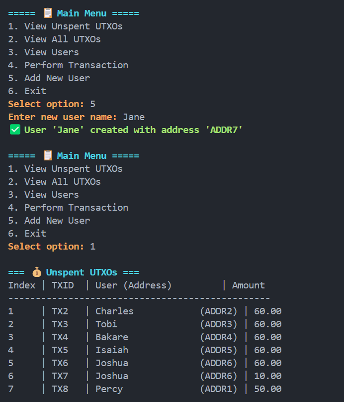

# 💸 UTXO-Based Transaction Simulator in C

A simple, menu-driven command-line tool that simulates a UTXO-based cryptocurrency system using the C programming language.

---

## 🧠 How It Works

### 🧍 Users and Addresses
- Each user allocated a unique address when created(e.g., `ADDRESS1`, `ADDRESS2`, ...).
- When a user is create upon program initialisation, they are automatically given **60 units** of currency via an initial UTXO.

### 💰 UTXO (Unspent Transaction Output) Model
- Transactions are made by consuming unspent UTXOs and generating new ones.
- The user specifies which UTXOs to use when sending funds.
- If a UTXO exceeds the transfer amount, change is sent back to the sender as a new UTXO.

### 📋 Menu Interface

```text
===== 📋 Main Menu =====
1. View Unspent UTXOs
2. View All UTXOs
3. View Users
4. Perform Transaction
5. Add New User
6. Exit
```

### 💻 Sample Interaction
 

### How to Compile and Run
- Compile
```bash
gcc -o utxo_simulation utxo_simulation.c
```

- Run
```bash
./utxo_simulation
```

### ⚠️ Notes
- UTXOs and users are stored in memory; all data resets on exit.
- The transaction model is simplified for simulation purposes.
