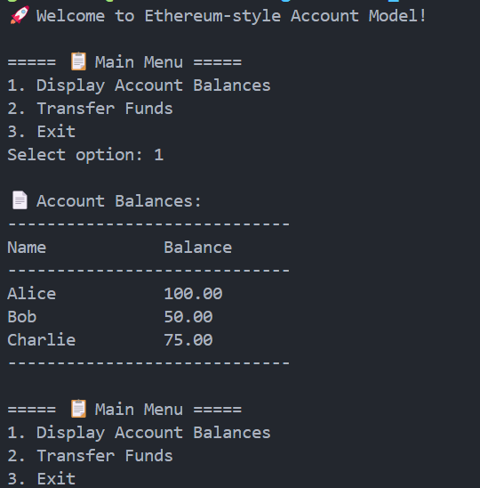
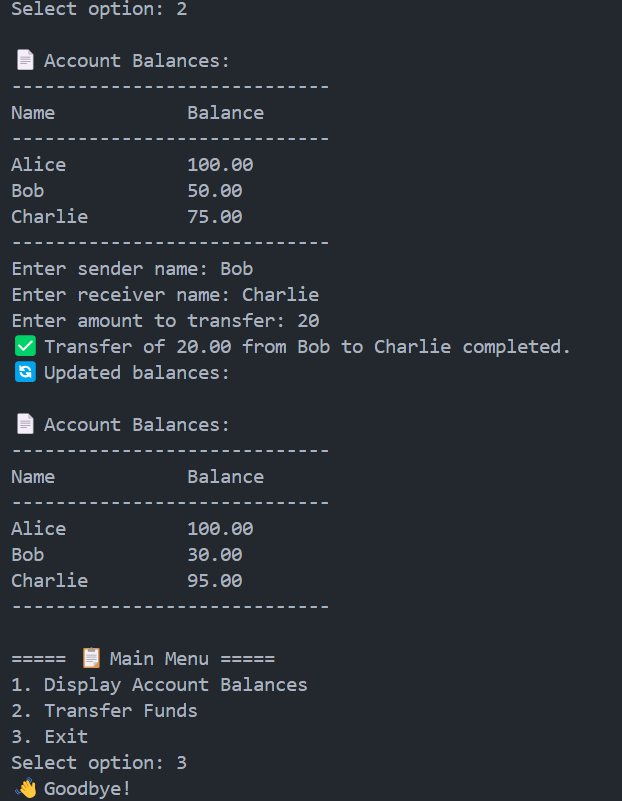

## Balance Model Simulator (in C)

This C program simulates a basic Account/Balance model similar to what is used in Ethereum. It demonstrates how transactions update account balances directly rather than using UTXOs like in Bitcoin.

### Features
- Maintain a list of accounts with names and balances.
- Allow fund transfers between accounts.
- Validate transactions (check if sender has enough balance).
- Display account balances before and after transactions.
- Menu-driven CLI for interactive user operations.

### How It Works
- Account struct holds name and balance.
- transferFunds(sender, receiver, amount):
    - Checks existence and balance.
    - Deducts from sender, adds to receiver.

### Sample Output
 

### How to Compile and Run
- Compile
```bash
gcc account_model_simulation.c -o account_model_simulation
```

- Run
```bash
./account_model_simulation
```
