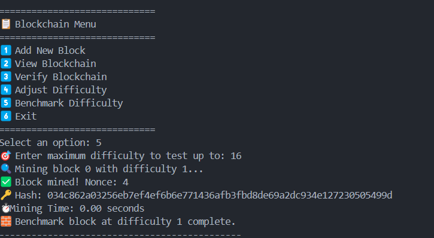

# Blockchain Mining Simulator in C

A four-part project that implements a blockchain simulator with proof-of-work mining, transaction handling, blockchain integrity verification, and difficulty benchmarking in C.

## 📌 Objective
To understand and implement the basic mechanics of blockchain mining using the C programming language. The project focuses on:
- Structuring transactions and blocks
- Implementing SHA-256 hashing
- Simulating proof-of-work (PoW) mining
- Validating blockchain integrity
- Observing the effect of mining difficulty on computational effort

## Requirements
    - GCC compiler or any C-compatible IDE (e.g., Visual Studio Code + C extension, CLion, Code::Blocks)
    - OpenSSL library for SHA-256 hashing
    - Basic to intermediate knowledge of:
    - C structs and pointers
    - Dynamic memory
    - File I/O (for extensions)
    - Cryptographic concepts (specifically SHA-256)

## Task Descriptions and compilation
### Task 1: Basic Block Structure and Mining
Objective: Implement a basic blockchain structure to support mining operations.
- Define a Block structure in C with:
    - index, timestamp, transactions[], previousHash, nonce, hash
- Implement or integrate a SHA-256 hashing function
    - (Uses OpenSSL in this project)

### Compilation:
```bash
gcc task1.c -o task1 -lssl -lcrypto
./task1
```

### Task 2: Implementing Proof of Work (PoW)
Objective: Develop the proof-of-work mechanism to secure block creation.

- Create a PoW function that repeatedly increments the nonce until a hash is found with a given number of leading zeros.
- The difficulty level controls how many zeros the hash must start with.

### Compilation:
```bash
gcc task2.c -o task2 -lssl -lcrypto
./task2
```

### Task 3: Mining a Block
Objective: Simulate the process of mining a block and adding it to the blockchain.
- Accept a list of user-defined transactions.
- Use the PoW function to mine a new block.
- Add the mined block to the blockchain.
- Verify the blockchain to ensure all links and hashes are valid after every block is mined.

### Compilation:
```bash
gcc task3.c -o task3 -lssl -lcrypto
./task3
```

### Task 4: Adjusting Blockchain Difficulty
Objective: Understand how mining difficulty affects computational time.
- Implement user-controlled difficulty levels (i.e., number of leading zeros).
- Track and display time taken to mine each block.
- Simulate mining blocks at increasing difficulty and log performance.

### Compilation:
```bash
gcc task4.c -o task4 -lssl -lcrypto
./task1
```

## Sample Output


